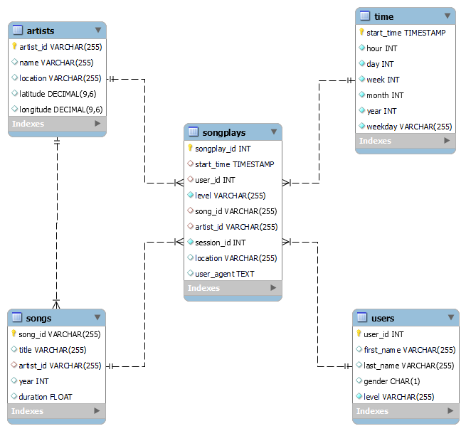

## Schema

#### Fact Table 
**songplays** - records in log data associated with song plays i.e. records with page `NextSong`

```
songplay_id, start_time, user_id, level, song_id, artist_id, session_id, location, user_agent
```

#### Dimension Tables
**users**  - users in the app
```
user_id, first_name, last_name, gender, level
```
**songs**  - songs in music database
```
song_id, title, artist_id, year, duration
```
**artists**  - artists in music database
```
artist_id, name, location, latitude, longitude
```
**time**  - timestamps of records in  **songplays**  broken down into specific units
```
start_time, hour, day, week, month, year, weekday
```

## EER model
